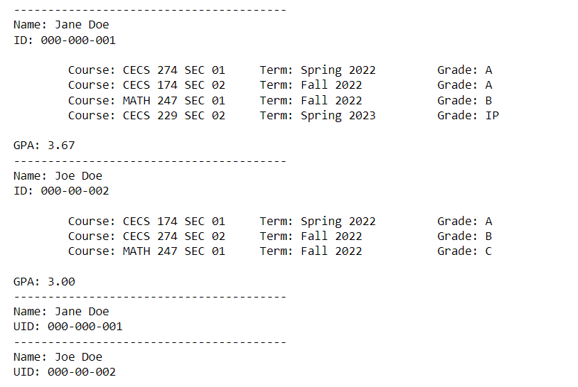

----

## Review on Classes

In programming, a ***class*** is a blueprint for an object.  A class defines what attributes and behaviors an object will support.  Classes are used when a program needs several objects that behave the same but might hold different data.  

For example, a software program that keeps track of student enrollment needs to model a single `Student` object with attributes name, ID, and courses with corresponding grades.  It also needs to define behaviors for

1. adding a course to the student record,
2. recording letter grades for the courses the student is enrolled in,
3. calculating the student's GPA,
4. printing the student's record.

Once this blueprint is defined, it can keep a log of several `Student` instances, i.e. objects, and manipulate them to perform the desired tasks.

The behaviors of an object are defined using a special function called a **method**.  The main difference between a function and a method is that a method can only be called on an object of the class that defines it.  For example, if `student1` is a `Student` object and `get_gpa()` is a method that the class defines, then the syntax for calling `get_gpa()` on `student1` is `student1.get_gpa()`. In Python, all methods defined by a class must include a special argument called `self`.  `self` is a keyword that is used to reference that the current object.

**SYNTAX | Class Method**

    class ClassName:
        .
        .
        .
        def method1(self, other parameters):
            #body goes here
            return

The **attributes** of an object are the data associated to the object.  A class defines what data an object of the class will have in a special method called a constructor.  In Python, the syntax for defining a constructor and default data is as follows:

**SYNTAX | Class Attributes**

    class ClassName:
    
        def __init__(self, arg1, arg2, ...):
            self.attribute1 = arg1
            self.attribute2 = arg2
            ...
            return

We can define how built-in functions and operations act on objects of our defined classes by implementing special methods.  One example of such a method is `__str__`.  The `__str__` method returns the string representation of an object, that is, it defines what string to return should the built-in function `str()` be called on an instance of the class.  Other special methods that can be implemented are:

* `__len__` - defines what integer to return if the function `len()` is called on an instance of the class.
* `__bool__` - defines what Boolean value to return if the `bool()` function is called on an instance of the class.
* `__lt__` - defines what the operator `<` should return if it is used to compare two instances of the class. 
* `__gt__` - defines what the operator `>` should return if it is used to compare two instances of the class.  
* `__eq__` - defines what the operator `==` should return if it is used to compare two instances of the class. 
* `__lt__` - defines what the operator `<` should return if it is used to compare two instances of the class. 

When we implement special methods of this type in our classes, we say we are *overloading* the relevant functions/operators.  You can find more information on overloading built-in operators and functions [here](https://realpython.com/operator-function-overloading/).

To summarize, a class defines the attributes (data) and the behaviors (actions on data) allowed for a certain type of object.  It can also overload built-in operators and functions so that they work on instances of the class.

**Example:**

    class Student:
        
        valid_grades = {'A' : 4.0, 'B' : 3.0, 'C' : 2.0, 'D' : 1.0, 'F': 0.0, 'W' : 'na', 'IP' : 'na', 'P' : 'na', 'NP' : 'na'}
        
        def __init__(self, name, uid):
            self.name = name
            self.uid = uid
            self.courses = {}
            
        def enroll(self, course, term):
            self.courses[course] = [term, 'IP']
            return 
        
        def record_grade(self, course, grade):
            if grade not in Student.valid_grades:
                raise ValueError("Invalid letter grade given.")
            if course not in self.courses:
                raise ValueError("Course not in student's record.")  
            self.courses[course][1] = grade
            return
        
        def get_gpa(self):
            grd_pts = 0
            num_courses = 0
            for course, details in self.courses.items():
                
                letter_grade = details[1]
                pts = Student.valid_grades[letter_grade]
                if type(pts) == float:
                    grd_pts += pts
                    num_courses += 1
            return grd_pts/num_courses
        
        def print_record(self):
            print("-"*40 + f"\nName: {self.name}\nID: {self.uid}\n")
            for course, details in self.courses.items():
                print("\tCourse: %-20sTerm: %-20sGrade: %s" % (course, details[0], details[1]))
            print("\nGPA: %.2f" % self.get_gpa())
            return
        
        def __str__(self):
            return f"Name: {self.name}\nUID: {self.uid}"

In the block below, several `Student` objects are created and manipulated using the `Student` instance methods.

    jane = Student("Jane Doe", "000-000-001")
    
    jane.enroll("CECS 274 SEC 01", "Spring 2022")
    jane.enroll("CECS 174 SEC 02", "Fall 2022")
    jane.enroll("MATH 247 SEC 01", "Fall 2022")
    jane.enroll("CECS 229 SEC 02", "Spring 2023")
    
    jane.record_grade("CECS 274 SEC 01", "A")
    jane.record_grade("CECS 174 SEC 02", "A")
    jane.record_grade("MATH 247 SEC 01", "B")
    
    
    joe = Student("Joe Doe", "000-00-002")
    joe.enroll("CECS 174 SEC 01", "Spring 2022")
    joe.enroll("CECS 274 SEC 02", "Fall 2022")
    joe.enroll("MATH 247 SEC 01", "Fall 2022")
    
    joe.record_grade("CECS 174 SEC 01", "A")
    joe.record_grade("CECS 274 SEC 02", "B")
    joe.record_grade("MATH 247 SEC 01", "C")
    
    
    jane.print_record()
    joe.print_record()
    
    print('-'*40)
    print(jane)
    print('-'*40)
    print(joe)

The output to the code above is:

Notice that the two `Student` objects are capable of behaving in the same way, i.e., they both have capability to enroll in courses and update a course grade.  However, because they are different objects, they store different information.
