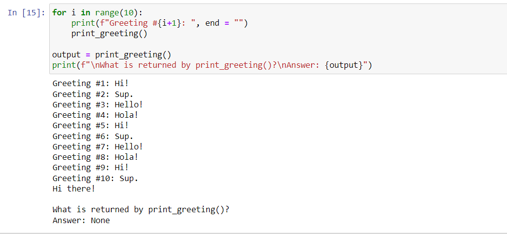
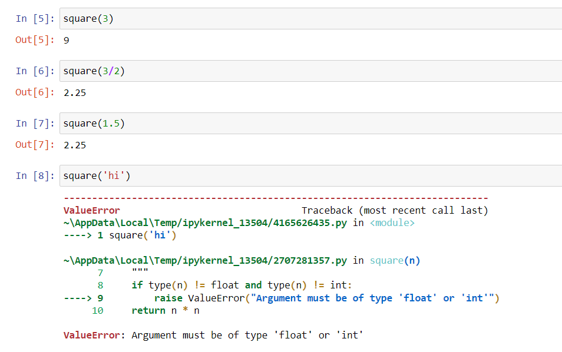

-----------------------------------

## Review on Functions

In programming, a ***function*** is a named block of reusable code.  Functions increase the readability of a program by eliminating the need for duplicate lines of code.  Instead, a single function call replaces the duplicate lines.  Functions may or may not take arguments to execute its purpose.  Functions always return either a null value or an intended value.  Below are basic syntax outlines for writing functions in Python:

**SYNTAX: Function without arguments nor intended return**

    def func_name():
        # body goes here
        return 

Note: If no intended return is specified, then the Python null value, `None` is returned.

**Example: No arguments nor intended return**

      from random import randint
      
      def print_greeting():
          """This function prints a random greeting"""
          greetings = ["Hello!", "Hi!", "Hola!", "Hi there!", "Sup."]
          print(greetings[randint(0, len(greetings)-1)])
          return

Calling the function and investigating output:

**SYNTAX: Function with arguments and intended return**

    def func_name(arg1, arg2, ...):
        # body goes here
        return value   

**Example: Argument and intended return**
  
    def square(n):
      """
      This function returns the square of the given value.
      A value error is raised if the given argument is not numeric
      INPUT: n - numeric value
      OUTPUT: the square of n
      """
      if type(n) != float and type(n) != int:
          raise ValueError("Argument must be of type 'float' or 'int'")
      return n * n

Calling the function with varying input data:

    
    

      